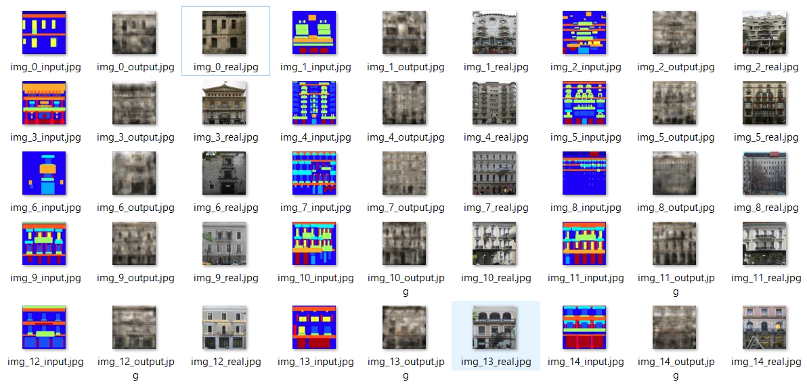
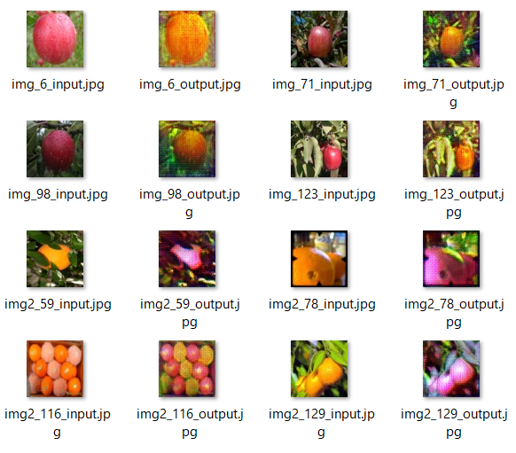
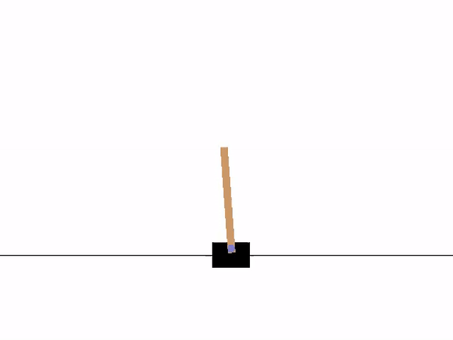

# ruby-dnn
[](https://badge.fury.io/rb/ruby-dnn)
[](https://travis-ci.org/unagiootoro/ruby-dnn)
[](https://rubydoc.info/gems/ruby-dnn)

ruby-dnn is a ruby deep learning library. This library supports full connected neural network and convolution neural network
and recurrent neural network.
Currently, you can get 99% accuracy with MNIST and 82% with CIFAR 10.

## Installation

Add this line to your application's Gemfile:

```ruby
gem 'ruby-dnn'
```

And then execute:

    $ bundle

Or install it yourself as:

    $ gem install ruby-dnn

## Usage

### MNIST MLP example

```ruby
model = Sequential.new

model << InputLayer.new(784)

model << Dense.new(256)
model << ReLU.new

model << Dense.new(256)
model << ReLU.new

model << Dense.new(10)

model.setup(Adam.new, SoftmaxCrossEntropy.new)

trainer = DNN::Trainer.new(model)
trainer.fit(x_train, y_train, 10, batch_size: 128, test: [x_test, y_test])
accuracy, loss = trainer.evaluate(x_test, y_test)
puts "accuracy: #{accuracy}"
puts "loss: #{loss}"

```

When create a model with 'define by run' style:  

```ruby
class MLP < Model
  def initialize
    super
    @d1 = Dense.new(256)
    @d2 = Dense.new(256)
    @d3 = Dense.new(10)
  end

  def forward(x)
    fs = DNN::Functions::FunctionSpace
    x = InputLayer.new(784).(x)
    x = @d1.(x)
    x = fs.relu(x)
    x = @d2.(x)
    x = fs.relu(x)
    x = @d3.(x)
    x
  end
end

model = MLP.new

model.setup(Adam.new, SoftmaxCrossEntropy.new)

trainer = DNN::Trainer.new(model)
trainer.fit(x_train, y_train, 10, batch_size: 128, test: [x_test, y_test])
accuracy, loss = trainer.evaluate(x_test, y_test)
puts "accuracy: #{accuracy}"
puts "loss: #{loss}"
```

Please refer to examples for basic usage.  
If you want to know more detailed information, please refer to the source code.

## Sample

* Pix2pix  
Convert an abstract image into a building image.  
[https://github.com/unagiootoro/facade-pix2pix](https://github.com/unagiootoro/facade-pix2pix)


* Cycle-GAN  
Convert apples to oranges and oranges to apples.  
[https://github.com/unagiootoro/apple2orange-cyclegan](https://github.com/unagiootoro/apple2orange-cyclegan)


* DQN  
Learn the game so that the pole on the cart does not fall.  
[https://github.com/unagiootoro/ruby-rl](https://github.com/unagiootoro/ruby-rl)


## Implemented
|| Implemented classes |
|:-----------|------------:|
| Connections | Dense, Conv2D, Conv2DTranspose, Embedding, SimpleRNN, LSTM, GRU |
| Activations | Sigmoid, Tanh, Softsign, Softplus, Swish, ReLU, LeakyReLU, ELU, Mish |
| Basic | Flatten, Reshape, Dropout, BatchNormalization |
| Pooling | MaxPool2D, AvgPool2D, GlobalAvgPool2D, UnPool2D |
| Optimizers | SGD, Nesterov, AdaGrad, RMSProp, AdaDelta, RMSPropGraves, Adam, AdaBound |
| Losses | MeanSquaredError, MeanAbsoluteError, Hinge, HuberLoss, SoftmaxCrossEntropy, SigmoidCrossEntropy |

## Datasets
By setting the environment variable `RUBY_DNN_DOWNLOADS_PATH`, you can specify the path to read dataset.

* Iris  
* MNIST  
* Fashion-MNIST  
* CIFAR-10  
* CIFAR-100  
* STL-10

## Use GPU
If you do `require "cumo/narray"` before `require "dnn"`, you can run it on GPU.
Or, set the environment variable `RUBY_DNN_USE_CUMO` to `ENABLE` to force the GPU to be used.

## Use Numo Linalg
When running on a CPU, you can speed it up by using Numo Linalg.
In this case, Numo Linalg is automatically loaded by setting the environment variable `RUNY_DNN_USE_NUMO_LINALG` to `ENABLE`.

## TODO
* Write a test.  
* Write a document.  
* Improve performance when using GPU.  

## Development

After checking out the repo, run `bin/setup` to install dependencies. Then, run `rake "test"` to run the tests. You can also run `bin/console` for an interactive prompt that will allow you to experiment.

To install this gem onto your local machine, run `bundle exec rake install`. To release a new version, update the version number in `version.rb`, and then run `bundle exec rake release`, which will create a git tag for the version, push git commits and tags, and push the `.gem` file to [rubygems.org](https://rubygems.org).

## Contributing

Bug reports and pull requests are welcome on GitHub at https://github.com/unagiootoro/ruby-dnn. This project is intended to be a safe, welcoming space for collaboration, and contributors are expected to adhere to the [Contributor Covenant](http://contributor-covenant.org) code of conduct.

## License

The gem is available as open source under the terms of the [MIT License](https://opensource.org/licenses/MIT).

## Code of Conduct

Everyone interacting in the ruby-dnn project’s codebases, issue trackers, chat rooms and mailing lists is expected to follow the [code of conduct](https://github.com/unagiootoro/ruby-dnn/blob/master/CODE_OF_CONDUCT.md).
