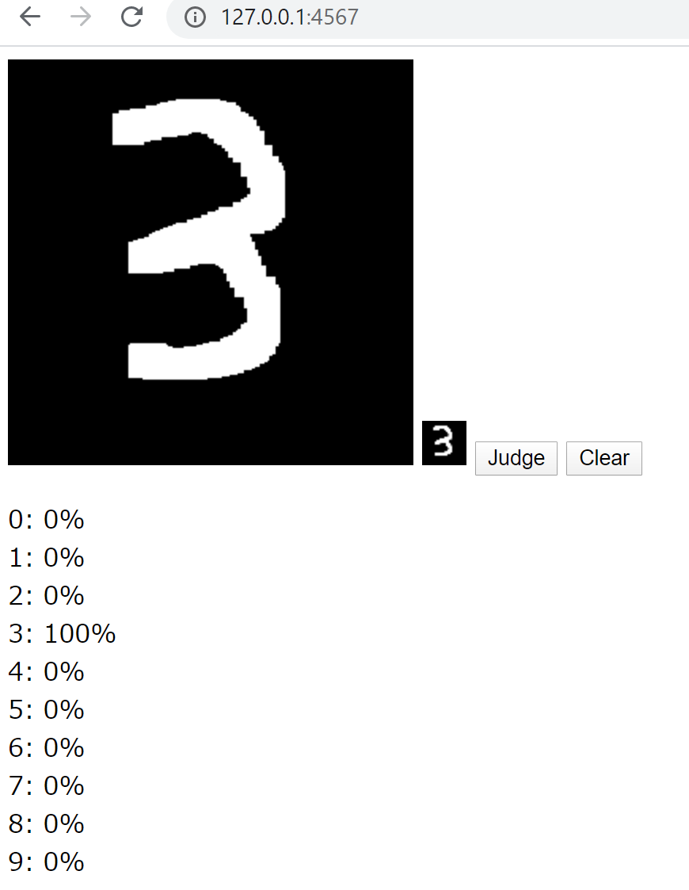

# Prepare
This example use to sinatra.

```
$ gem install sinatra
$ gem install sinatra-contrib
```

# Let's try
This example prepared weights that have already been trained.
If you want to try it immediately, skip steps (1) and (2).

### (1) Training MNIST
```
$ ruby mnist_train.rb
```

### (2) Make weights
```
$ ruby make_weights.rb
```

### (3) Launch sinatra server
```
$ ruby server.rb
```

### (4) Access 127.0.0.1:4567 with your browser

